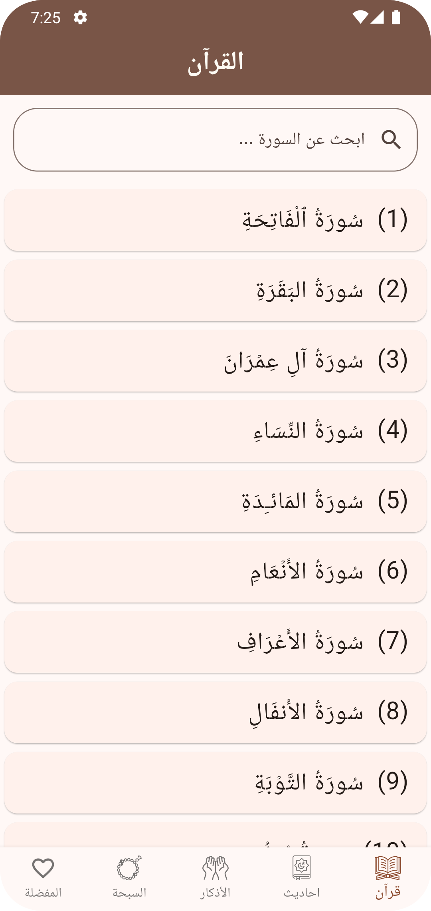
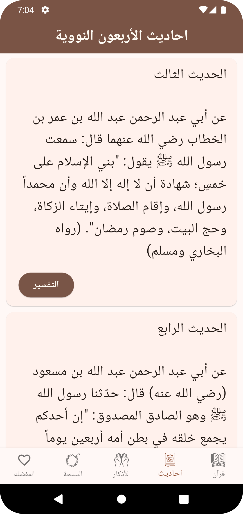
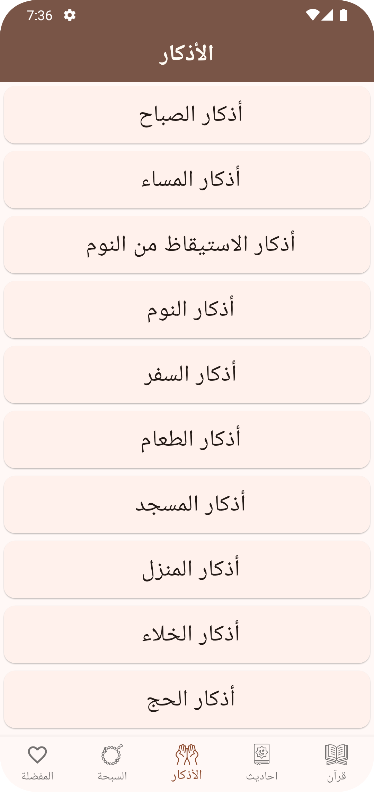
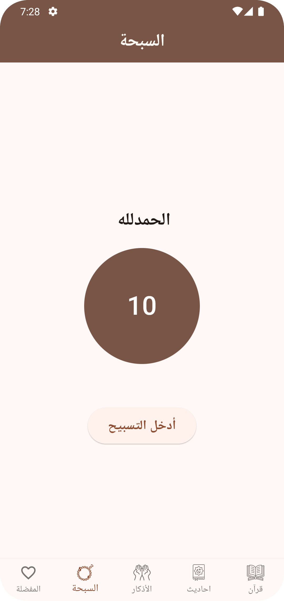
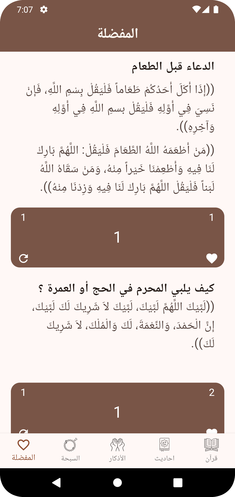

# 📖 Qurany App

**Qurany** is an Islamic Flutter mobile application designed to help users stay spiritually connected through a collection of Islamic features — including **Quran**, **Azkar**, **Hadiths**, **Tasbeeh**, and a **Favorites section** for saving personal Azkar.

---

## 📸 Screenshots

| Quran                                  | Hadiths                                    | Azkar | Tasbeeh | Favorites |
|----------------------------------------|--------------------------------------------|--------|-----------|-----------|
|  |  |  |  |  |

---

## 🌙 Features

- 🕋 **Quran Section**  
  Browse and read all Quran surahs easily. Includes search functionality to find surahs by name.

- 🤲 **Azkar (Remembrances)**  
  Morning, evening, and daily Azkar with counting support for each zikr.

- 📚 **Hadiths**  
  Access a collection of authentic Hadiths.

- 🔢 **Tasbeeh Counter**  
  Simple and interactive digital Tasbeeh for counting dhikr.

- ❤️ **Favorites**  
  Save your favorite Azkar and access them anytime — stored locally using `SharedPreferences`.

- 🌐 **Beautiful UI**  
  Simple, elegant, and easy-to-use design following the MVVM (Model-View-ViewModel) architecture.

---

## ⚙️ Technologies Used

- **Flutter** (Dart)
- **Provider** for state management
- **SharedPreferences** for local data persistence
- **MVVM Architecture Pattern**

